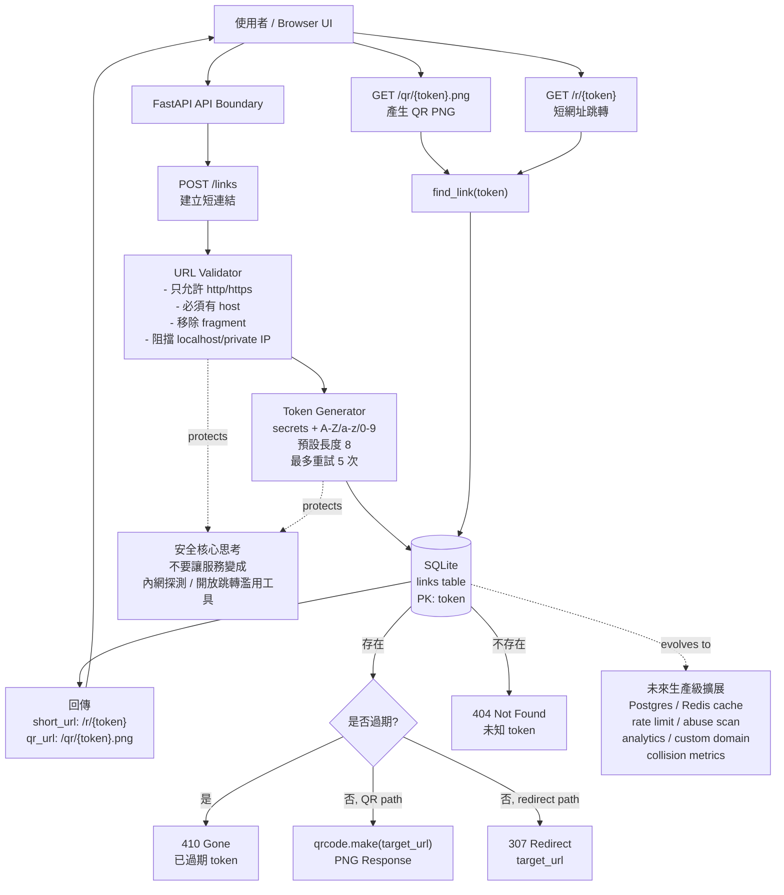
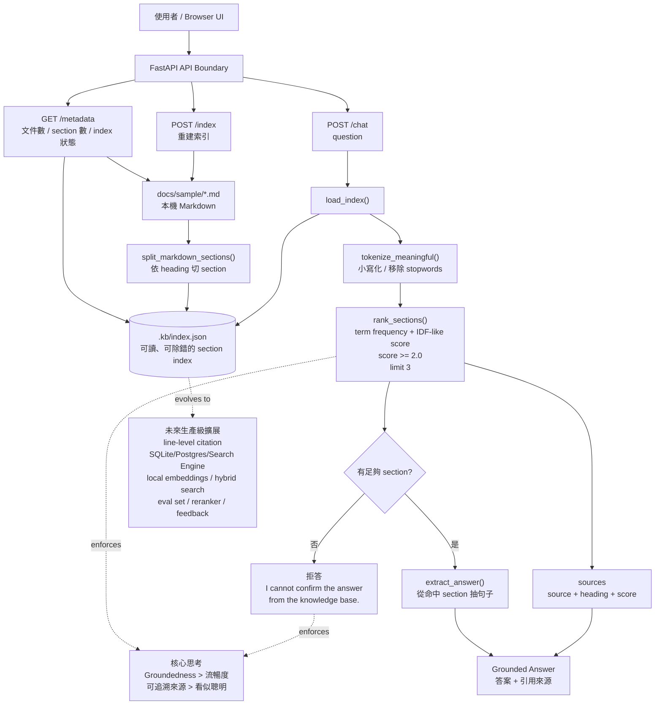
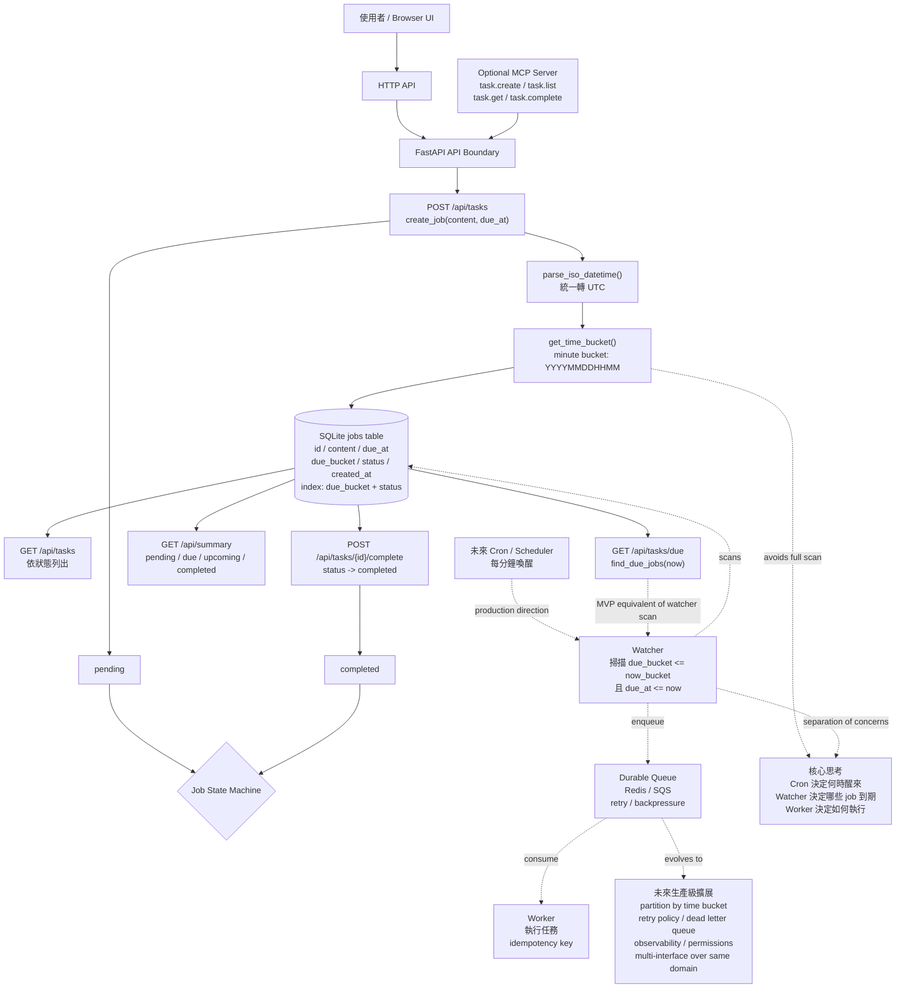

# 三個專案的系統設計架構圖

> Accuracy note: 以下不是宣稱來自任何大廠內部文件，而是依照常見系統設計實務整理：清楚邊界、資料所有權、狀態流、可靠性、安全性、可觀測性與可擴展性。

## 1. QR Code Generator

### 核心設計重點

- 問題本質：把一個外部 URL 轉成可分享的短網址與 QR Code。
- 核心資料：`links(token, target_url, created_at, expires_at)`。
- 核心原則：公開 token 不能可預測；Redirect 前必須驗證 token 與過期狀態；使用者輸入 URL 不能直接信任。
- MVP 邊界：FastAPI + SQLite + 即時產生 PNG；不做帳號、分析、網域管理、風險掃描。



### 工作流

```text
輸入 URL
→ 驗證 URL 安全性
→ 產生不可預測 token
→ 寫入 SQLite
→ 回傳短網址與 QR 圖片網址
→ 使用者掃 QR 或打開短網址
→ 系統查 token
→ 不存在回 404，過期回 410，正常則回 PNG 或 307 redirect
```

## 2. Knowledge Base Q&A Bot

### 核心設計重點

- 問題本質：只根據本機 Markdown 知識庫回答問題，不憑空猜。
- 核心資料：`docs/sample/*.md` 與 `.kb/index.json`。
- 核心原則：先檢索，再回答；答案必須有來源；找不到證據就拒答。
- MVP 邊界：關鍵字檢索與抽取式答案；不使用付費 API、不使用外部生成服務、不使用向量資料庫。



### 工作流

```text
Rebuild Index
→ 讀取 Markdown
→ 依標題切成可引用 section
→ 寫入 .kb/index.json

Ask Question
→ 載入 index
→ 將問題 tokenize
→ 對 section 計分排序
→ 分數不足就拒答
→ 分數足夠就抽取答案句子
→ 回傳答案與 source / heading / score
```

## 3. Task Scheduler

### 核心設計重點

- 問題本質：管理「何時該做」的工作，而不是直接執行所有工作。
- 核心資料：`jobs(id, content, due_at, due_bucket, status, created_at)`。
- 核心原則：排程時間、任務狀態、到期掃描要分開；查 due job 不能每次全表掃描。
- MVP 邊界：FastAPI + SQLite + Web UI；MCP 是可選入口；Queue / Worker 是設計方向但目前未實作。



### 工作流

```text
建立任務
→ 驗證 content 與 due_at
→ due_at 統一轉 UTC
→ 建立 minute-level due_bucket
→ 寫入 jobs，狀態為 pending

查詢到期任務
→ 取得 now
→ 轉成 current_bucket
→ 查 status = pending 且 due_bucket <= current_bucket 且 due_at <= now
→ 回傳 due jobs

完成任務
→ 用 job id 查詢
→ status 改為 completed
→ summary 重新計算 pending / completed / due / upcoming
```

